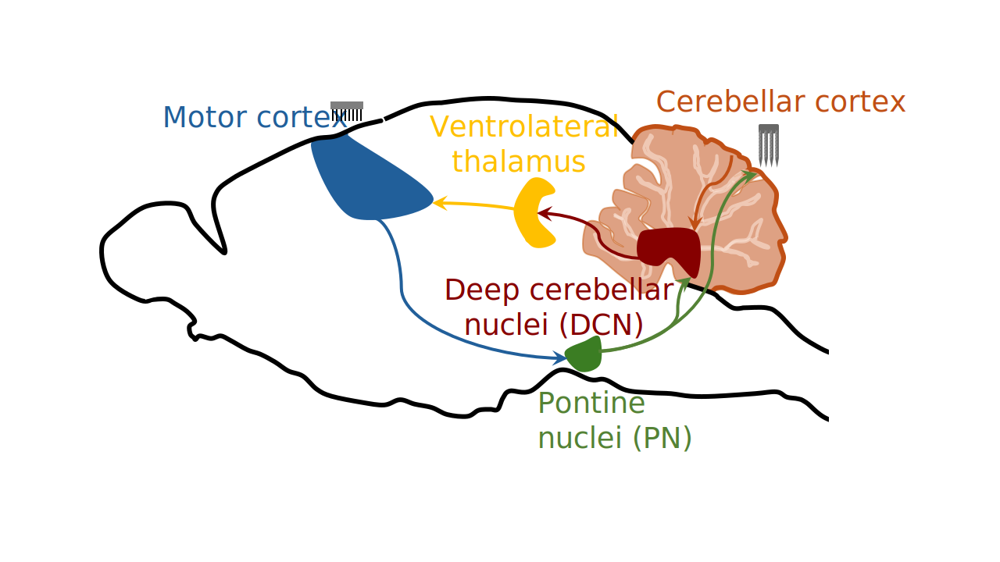
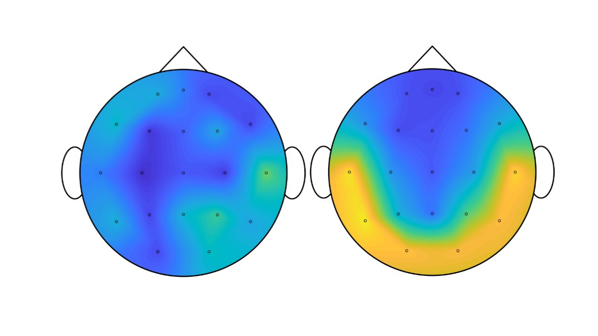
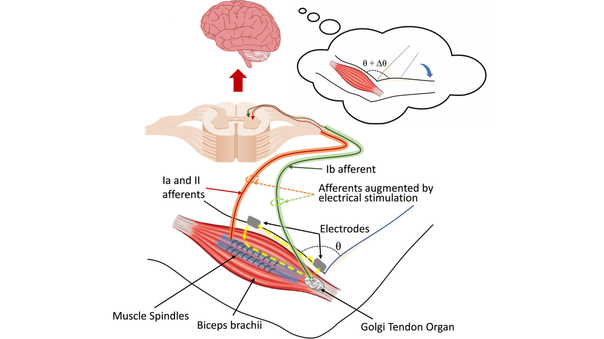

## Cortico-cerebellar interaction underlying neuroprosthetic control

Can cerebellar neural activity be used for neuroprosthetic control?

Multiple regions of the brain coordinate their neural activity to achieve different motor tasks. Years of research have focused on  the primary motor cortex as the principal target for brain-machine interfaces. However, other subcortical brain regions connected to the motor cortex and well known for their role in motor control, such as the cerebellum, have not been validated for neuroprosthetic control.
This poses the question: can we use subcortical regions such as the cerebellum for a brain-machine interface when the primary motor cortex is injured? Our work shows that cerebellum neural activity can be used for BMI in both healthy and stroke-injured motor cortex brains. 

## Sleep oscillations post-stroke

Guess which topographical EEG map corresponds to a healthy subject vs a stroke patient? and which side the stroke is on?

Sleep is known to promote recovery post-stroke. Recent rodent work ([Kim et al 2022](https://www.sciencedirect.com/science/article/pii/S2211124722001504)) showed that resurgence of physiologic spindles coupled to sleep slow oscillations(SOs) and a concomitant decrease in pathological delta(δ) waves is associated with sustained motor performance gains during stroke recovery. This work classified SO-nested spindles as restorative post-stroke and δ-wave-nested spindles as pathological. This led us to investigate sleep oscillations in human stroke patients. We found that stroke subjects had pronounced acute asymmetry of these sleep oscillations, with a dominance of SOs, δ-waves, spindles, and nested spindles in one hemisphere, compared to the healthy subjects. These results showed that δ-wave nested spindle and SO-nested spindle densities can serve as important biomarkers to track motor recovery post-stroke. 

## Proprioceptive modulation and augmentation

Can transcutaneous electrical stimulation modulate proprioception?

Proprioceptive deficits resulting from neural injuries make it challenging for the nervous system to adapt to compromised sensorimotor conditions. To address these proprioceptive deficits, several invasive and non-invasive approaches like vibration, electrical nerve stimulation, and skin stretch have been introduced. However, proprioceptive modulation is still challenging as the current solutions have limitations in terms of effectiveness, usability, and consistency. We proposed a new way of modulating proprioception using transcutaneous electrical stimulation and showed its efficacy in modulating proprioception and generating kinesthetic illusion. 
